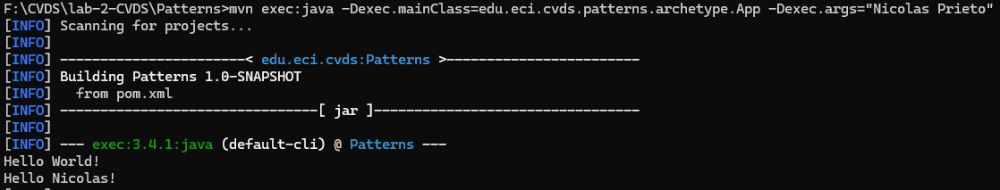
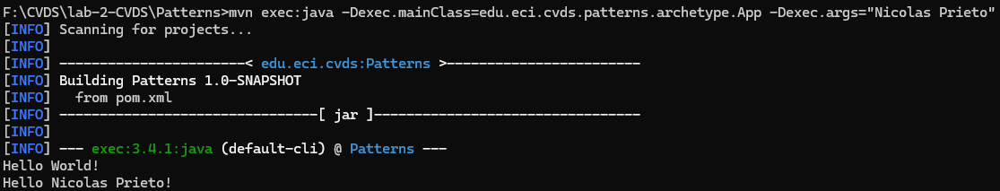
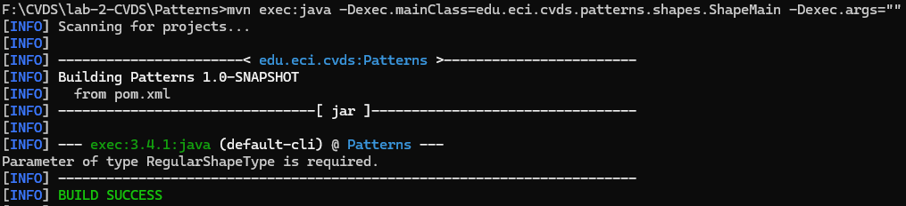
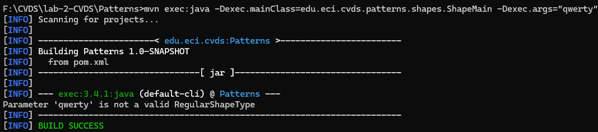
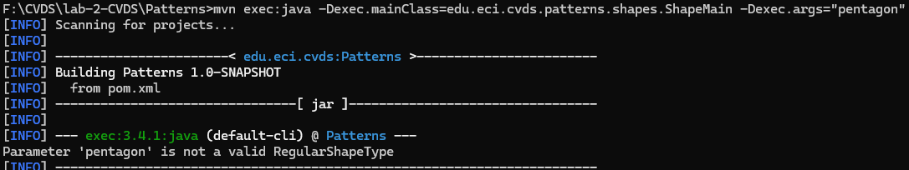
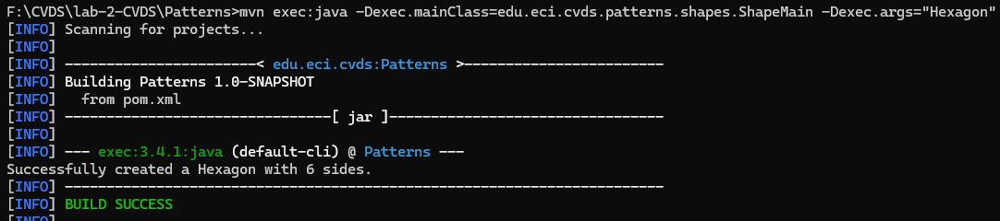

# Lab 2 - CVDS

**Integrantes:**  
- Juan Esteban Cancelado Sánchez  
- Nicolás Prieto Vargas

---

### Preguntas y respuestas:

**1. Ejecutar la clase con su nombre y apellido como parámetro. ¿Qué sucedió?**

Al ejecutar la clase con el nombre y apellido como parámetro, solo se muestra el nombre, ya que el programa está configurado para mostrar únicamente el primer argumento.

**2. Verifique cómo enviar los parámetros de forma "compuesta" para que el saludo se realice con nombre y apellido.**

Se ejecutó nuevamente el programa utilizando el nombre y apellido como un solo argumento compuesto. Ahora, el saludo se muestra correctamente con el nombre completo.

---

### Factory:

**¿Cuál fábrica hicieron y cuál es mejor?**

Optamos por implementar la `Simple Factory` porque fue la más fácil de implementar para este caso. Consideramos que esta es la mejor opción, ya que permite que la clase `ShapeMain` se comunique directamente con `ShapeFactory`, y esta, dependiendo del argumento ingresado, se comunica con `RegularShape` y `Shape` para dar la respuesta correspondiente.

---

### Pruebas:

**1. Sin parámetros:**

**2. Con `qwerty`:**

**3. Con `pentagon`:**

**4. Con `Hexagon`:**

**¿Cuál(es) de las anteriores instrucciones se ejecutan y funcionan correctamente y por qué?**

Todas las instrucciones se ejecutan correctamente, pero solo la opción `Hexagon` da la respuesta esperada, ya que es un caso válido. En los otros casos, el texto ingresado no coincide con ninguna de las opciones previstas, por lo que el programa devuelve un mensaje de error. Si no se ingresa ningún parámetro, el programa solicita que se ingrese uno válido.

---
